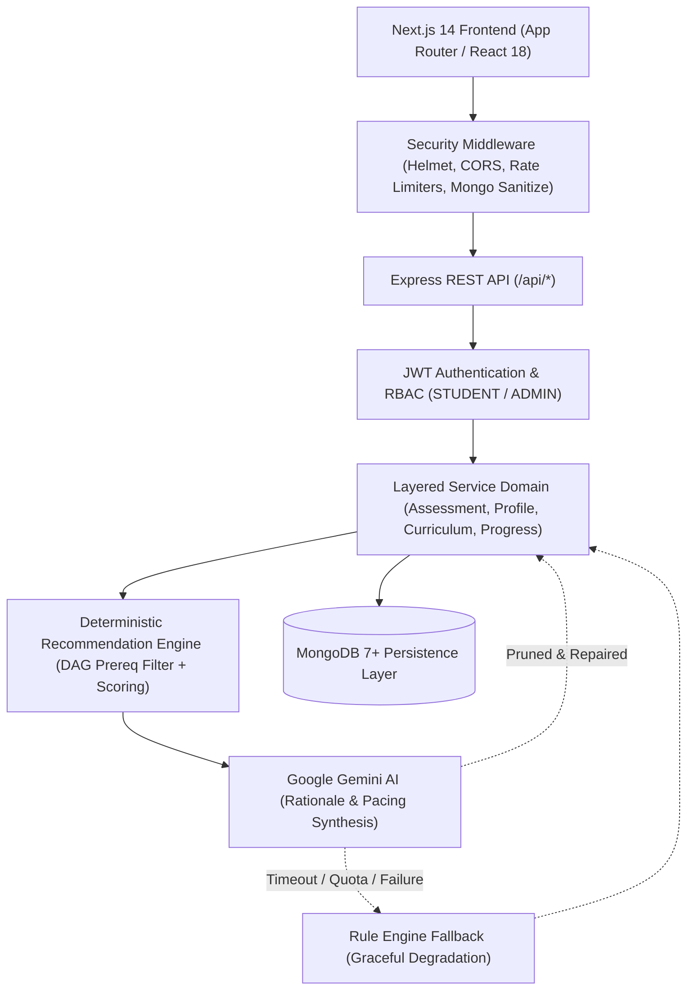
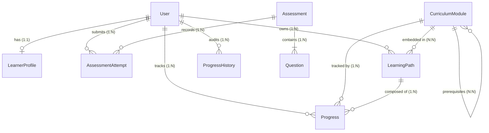

# PsychePath — Psychometric Learning Path Recommender

[](https://nodejs.org/)
[](https://nextjs.org/)
[](https://expressjs.com/)
[](https://www.mongodb.com/)
[](https://ai.google.dev/)
[](https://jestjs.io/)
[](LICENSE)

PsychePath is an AI-augmented educational engineering platform that synthesizes individualized curriculum pathways. By coupling **authoritative psychometric assessment scoring**, **directed acyclic graph (DAG) curriculum filtering**, and **Google Gemini AI contextual rationale generation**, PsychePath solves the two fundamental flaws of modern EdTech: generic static playlists and hallucinated, unverified AI course recommendations.

---

## Quick Links & Detailed Documentation

- **[System Architecture & Data Flows](docs/architecture.md)** — Architectural diagrams, layered pipeline, sequence diagrams, and resilience.
- **[Database Model & ER Diagram](docs/database.md)** — Comprehensive Mongoose schema definitions, indexes, relations, and constraints.
- **[REST API Reference Manual](docs/api.md)** — Endpoints, request/response payloads, authentication, and validation codes.
- **[Local Setup & Developer Guide](docs/setup.md)** — Step-by-step setup, environment variables, seeding, and verification.
- **[UI Showcase & Screenshot Checklist](docs/screenshots.md)** — Interface walkthrough and screenshot capture instructions.
- **[Technical Decisions & Tradeoffs](docs/technical-decisions.md)** — In-depth architectural rationales and design decisions.
- **[Interview & Project Explanation Guide](docs/interview-guide.md)** — Concise talking points, technical deep dives, and Q&A.
- **[Portfolio & Resume Material](docs/portfolio.md)** — Measurable bullet points, one-line summary, and resume blurbs.

---

## 1. Problem Statement

Traditional online learning platforms present major shortcomings for learners:

1. **One-Size-Fits-All Curricula**: Students receive identical linear course playlists regardless of whether they excel with hands-on projects, analytical deep dives, or collaborative exercises.
2. **The "Black Box" AI Trap**: Prompting Large Language Models directly to generate curriculum plans frequently results in **hallucinated courses**, broken URLs, and illogical prerequisite sequencing (such as placing Advanced Distributed Systems before Basic Networking).
3. **No Progress Accountability**: Progress systems often allow arbitrary skipping, accidental regressions, or lack an immutable audit trail of learning velocity.

PsychePath addresses these challenges through a **deterministic-first, AI-augmented architecture**:

- **Prerequisites and eligibility** are mathematically proven via **Directed Acyclic Graphs (DAG)**.
- **Cognitive styles and skill gaps** are authoritatively scored on the server.
- **Google Gemini** is utilized strictly for contextual rationale synthesis, personalized study strategies, and pacing advice.
- **Monotonic progress tracking** guarantees regression-proof milestones with an immutable audit log.

---

## 2. Key Features

- **Authoritative Psychometric Assessment Engine**: Timed evaluations assessing four cognitive dimensions: _Analytical_, _Intuitive_, _Collaborative_, and _Practical_. Scoring weights remain hidden from clients to prevent tampering.
- **Dynamic Learner Profiling**: Automatically translates assessment results into cognitive strengths ($\ge 75\%$) and growth areas ($< 60\%$), combined with user-managed goals and weekly commitments.
- **DAG-Based Curriculum Graph**: 20 interconnected modules with strict prerequisite dependencies and cycle prevention.
- **Two-Stage Recommendation Engine**:
  - _Stage 1_: Deterministic multi-attribute candidate scoring ($40\%$ goal fit, $35\%$ skill gap, $25\%$ cognitive match).
  - _Stage 2_: Google Gemini 1.5/2.0 contextual rationale generation and pacing strategy synthesis.
- **Zero-Hallucination & Topological Sequencing**: Strict schema validation prunes any unrecognized module references; a topological sorter guarantees prerequisites are never violated.
- **Graceful Fallback**: Automatically degrades to a deterministic `RULE_ENGINE` without disruption if AI services time out, hit quota limits, or lack API keys.
- **Single Active Path Invariant & Versioning**: Automatically archives older learning paths upon new generation and increments version counters.
- **Monotonic Progress Tracking**: Rejects percentage regressions with HTTP 400 `PROGRESS_REGRESSION` while appending every change to an immutable `ProgressHistory` ledger.
- **Role-Based Access Control (RBAC)**: Enforces least-privilege security between `STUDENT` and `ADMIN` users.
- **Comprehensive Admin Dashboard**: Platform-wide KPIs, paginated learner directory with status toggling, and curriculum authoring with prerequisite cycle detection.

---

## 3. Technology Stack

| Layer                  | Technology                       | Purpose                                                                           |
| ---------------------- | -------------------------------- | --------------------------------------------------------------------------------- |
| **Frontend**           | **Next.js 14 (App Router)**      | Modern nested layouts, server-side structure, and fast client-side rendering.     |
| **UI Library**         | **React 18**                     | Interactive assessments, real-time timers, dynamic sliders, and responsive state. |
| **Styling**            | **Vanilla CSS Modules**          | Modern dark-themed design system with CSS custom properties.                      |
| **Backend**            | **Node.js & Express.js**         | Non-blocking event-driven REST API server with layered modular architecture.      |
| **Database**           | **MongoDB 7+**                   | High-performance document database with compound indexing and atomic operations.  |
| **ODM**                | **Mongoose 8**                   | Schema validation, type safety, query middleware, and model population.           |
| **AI Personalization** | **Google Gemini API**            | Contextual learning strategies, module rationales, and estimated study schedules. |
| **Security**           | **Helmet, Rate-Limit, Sanitize** | Defense-in-depth protection against XSS, DoS, brute-force, and NoSQL injection.   |
| **Testing**            | **Jest & Supertest**             | 67 automated unit and integration tests across 10 test suites.                    |

---

## 4. System Architecture



For complete sequence diagrams and component details, see **[System Architecture & Data Flows](docs/architecture.md)**.

---

## 5. Database Architecture & ER Model



For detailed schema definitions, data types, constraints, and index strategies, see **[Database Architecture](docs/database.md)**.

---

## 6. End-to-End Recommendation & AI Workflow

```text
[1. Candidate Generation]
  └── Queries active modules (isActive: true)
  └── Evaluates prerequisite DAG against learner's current skills
  └── Discards modules whose prerequisites are not yet met

[2. Deterministic Fit Scoring]
  └── Goal Match Score (40% weight): Matches module skills against target goals
  └── Skill Gap Score (35% weight): Matches module skills not yet mastered
  └── Cognitive Style Match (25% weight): Matches module category with profile strengths
  └── Base Score = 0.40(Goal) + 0.35(Skill) + 0.25(Style)

[3. AI Contextual Synthesis (Google Gemini)]
  └── Sends top K candidates + learner profile signals into structured prompt
  └── Gemini synthesizes custom rationales, pacing tips, and focus strategies
  └── Validates response against strict JSON schema

[4. Post-Processing & Safety Guarantees]
  └── Hallucination Pruning: Strips any module ID not in the original candidate pool
  └── Topological Sort Repair: Restores valid prerequisite ordering if AI altered sequence
  └── Resilient Fallback: Activates deterministic Rule Engine if Gemini times out or errors
```

---

## 7. Security & Hardening Features

- **Multi-Tiered Rate Limiting**:
  - `authLimiter`: 10 requests / 15 mins (mitigates credential stuffing).
  - `aiLimiter`: 5 requests / 15 mins (prevents AI cost overruns and API quota exhaustion).
  - `submissionLimiter`: 20 requests / 15 mins (prevents rapid assessment re-submissions).
  - `globalLimiter`: 100 requests / 15 mins (general DoS mitigation).
- **NoSQL Injection Sanitization**: Strips dangerous MongoDB operator keys (`$gt`, `$where`, `$regex`) via `mongo-sanitize`.
- **HTTP Security Headers**: Uses `helmet` to set CSP, HSTS, X-Frame-Options, and nosniff directives.
- **Strict Payload Constraints**: Ingress body payloads restricted to `10kb` to thwart buffer exhaustion attacks.
- **Redacted Logging**: Sensitive fields (`password`, `token`, `authorization`, `cookie`) are redacted prior to log output.

---

## 8. Project Structure

```text
PsychePath/
├── client/                     # Next.js 14 Frontend Application
│   ├── app/                    # Next.js App Router (18 routes)
│   │   ├── admin/              # Admin dashboard, learners, curriculum management
│   │   ├── assessments/        # Catalog, test-taking, results
│   │   ├── curriculum/         # Curriculum exploration & module details
│   │   ├── dashboard/          # Student main dashboard
│   │   ├── learning-path/      # Path visualizer & regeneration
│   │   ├── login/ & register/  # Authentication forms
│   │   ├── profile/            # Learner profile & psychometric settings
│   │   └── progress/           # Monotonic tracker & audit history
│   ├── components/             # Reusable UI components & layouts
│   ├── context/                # AuthContext & global state
│   └── services/               # Centralized API service layer
│
├── server/                     # Express.js REST API Backend
│   ├── config/                 # Centralized configuration & DB connection
│   ├── controllers/            # HTTP request/response handlers
│   ├── middleware/             # Auth, RBAC, Rate-Limit, Sanitize, Error handlers
│   ├── models/                 # Mongoose 8 Data Models (User, Path, Progress, etc.)
│   ├── routes/                 # Express route definitions
│   ├── scripts/                # Database seeder (seed.js & seedData.js)
│   ├── services/               # Pure business logic, recommendation & AI engines
│   ├── tests/                  # Automated Jest unit and integration suites
│   ├── utils/                  # Structured logger & legacy verifiers
│   └── validators/             # Request payload validation schemas
│
├── docs/                       # Technical Documentation Suite
│   ├── architecture.md         # System Architecture & Sequence Diagrams
│   ├── database.md             # ER Diagram & Schema Specifications
│   ├── api.md                  # REST API Reference Manual
│   ├── setup.md                # Local Setup & Developer Guide
│   ├── screenshots.md          # UI Showcase & Screenshot Guide
│   ├── technical-decisions.md  # Architectural Rationale & Tradeoffs
│   ├── interview-guide.md      # Technical Explanation & Interview Guide
│   └── portfolio.md            # Resume Bullet Points & Portfolio Blurbs
│
├── package.json                # Root orchestration runner
└── README.md                   # Project Overview & Quick Start
```

---

## 9. Quick Start & Local Setup

### 9.1 Prerequisites

- **Node.js**: `v18.x` or higher (verified on `v20.18.0 LTS`)
- **npm**: `v9.x` or higher (verified on `v10.8.2`)
- **MongoDB**: Running at `mongodb://localhost:27017` or MongoDB Atlas URI

### 9.2 Step-by-Step Installation

```bash
# 1. Clone the repository
git clone https://github.com/Anonav0/PsychePath.git
cd PsychePath

# 2. Install all dependencies across root, server, and client
npm run install:all

# 3. Configure environment variables
cp .env.example server/.env
# (Optionally add GEMINI_API_KEY in server/.env)

# 4. Seed the database with sample personas and curriculum
npm run seed:reset

# 5. Start development servers concurrently
npm run dev
```

- **Frontend**: [http://localhost:3000](http://localhost:3000)
- **Backend API**: [http://localhost:5000](http://localhost:5000)
- **Health Check**: [http://localhost:5000/api/health](http://localhost:5000/api/health)

For comprehensive setup details, see **[Local Setup Guide](docs/setup.md)**.

---

## 10. Seed Accounts & Credentials

The database seeder provisions verified test accounts across distinct lifecycle stages:

| Role                    | Email                              | Password        | Lifecycle Stage                                                                          |
| ----------------------- | ---------------------------------- | --------------- | ---------------------------------------------------------------------------------------- |
| **Administrator**       | `admin@psychepath.com`             | `AdminPass123!` | Full system access to `/admin` dashboard, learner management, and curriculum DAG editor. |
| **Student (New)**       | `student.new@psychepath.com`       | `Password123!`  | Fresh account: 0 attempts, no profile, ready to take first assessment.                   |
| **Student (Assessed)**  | `student.assessed@psychepath.com`  | `Password123!`  | Completed cognitive assessment; ready to generate first learning path.                   |
| **Student (Active)**    | `student.active@psychepath.com`    | `Password123!`  | Active learning path v1 with 2 modules in progress; ready to test progress updates.      |
| **Student (Completed)** | `student.completed@psychepath.com` | `Password123!`  | Completed 100% of path v1; contains full immutable progress history.                     |
| **Student (Inactive)**  | `student.inactive@psychepath.com`  | `Password123!`  | Deactivated account (`isActive: false`) to test login rejection.                         |

---

## 11. Testing & Quality Assurance

### 11.1 Automated Jest Test Suites (67/67 Tests Passing)

Run backend integration and unit tests:

```bash
npm test --prefix server
```

### 11.2 Standalone Model & Service Verifiers

Run the 10 legacy verification suites:

```bash
npm run test:all --prefix server
```

### 11.3 Next.js Frontend Production Build

Confirm all 18 client routes compile with zero errors:

```bash
npm run build --prefix client
```

---

## 12. REST API Overview

| Method  | Endpoint                                               | Access          | Purpose                                      |
| ------- | ------------------------------------------------------ | --------------- | -------------------------------------------- |
| `POST`  | `/api/auth/register`                                   | Public          | Register new student account                 |
| `POST`  | `/api/auth/login`                                      | Public          | Authenticate user and receive JWT            |
| `GET`   | `/api/auth/me`                                         | Bearer          | Fetch authenticated user profile             |
| `GET`   | `/api/assessments`                                     | Public / Bearer | List active assessments                      |
| `POST`  | `/api/assessments/:id/attempts`                        | Student / Admin | Start new timed assessment attempt           |
| `POST`  | `/api/attempts/:id/submit`                             | Student / Admin | Authoritative server-side grading            |
| `GET`   | `/api/profiles/me`                                     | Student / Admin | Fetch current learner profile                |
| `POST`  | `/api/profiles/me/generate-from-assessment/:attemptId` | Student / Admin | Synthesize profile from assessment scores    |
| `GET`   | `/api/curriculum`                                      | Student / Admin | Browse curriculum with prerequisite metadata |
| `GET`   | `/api/recommendations`                                 | Student / Admin | Fetch scored module recommendations          |
| `POST`  | `/api/learning-paths/generate`                         | Student / Admin | Generate AI-augmented learning path          |
| `GET`   | `/api/learning-paths/current`                          | Student / Admin | Fetch current active learning path           |
| `PATCH` | `/api/progress`                                        | Student / Admin | Monotonic module progress update             |
| `GET`   | `/api/progress/:pathId/history`                        | Student / Admin | Retrieve immutable audit history             |
| `GET`   | `/api/admin/stats`                                     | Admin Only      | Platform telemetry and analytics             |
| `GET`   | `/api/admin/learners`                                  | Admin Only      | Paginated learner directory                  |
| `PATCH` | `/api/admin/learners/:id/status`                       | Admin Only      | Toggle learner active status                 |

For complete documentation with JSON payloads, see **[REST API Reference Manual](docs/api.md)**.

---

## 13. Future Roadmap & Scope

1. **Adaptive Testing (CAT)**: Item Response Theory (IRT) engine dynamically adjusting question difficulty based on real-time student responses.
2. **Interactive Code Sandboxes**: In-browser WebAssembly-powered coding execution directly inside curriculum modules.
3. **Multi-Tenant Organizations**: Sub-organizations for universities and enterprises with customized curriculum catalogs and departmental reporting.
4. **Peer Collaboration Groups**: Cohort-based learning path synchronization connecting learners with complementary cognitive styles.
5. **Real-Time WebSocket Progress**: Live streak notifications and instructor presence indicators.

---

## 14. License

This project is licensed under the MIT License — see the [LICENSE](LICENSE) file for details.
